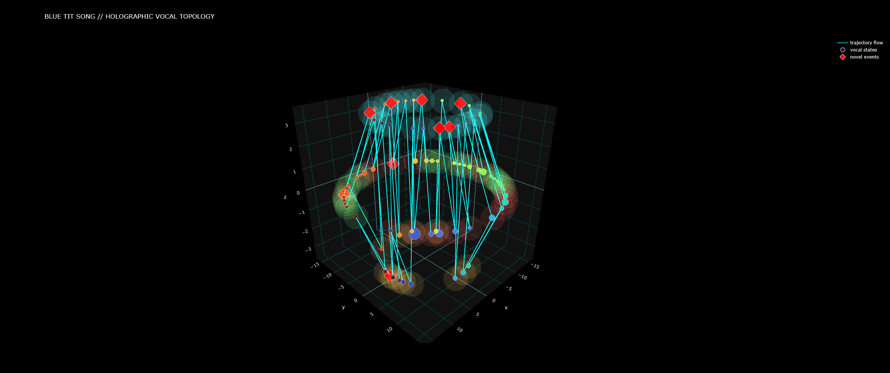

# Bioacoustic Topology

<div align="center">


</div>

---

# Dynamic Acoustic State-Space Modeling of Eurasian Blue Tit Vocal Sequences

## Latent Acoustic Geometry, Motif Grammar, and Temporal Bioacoustic Topology


This repository explores whether birdsong can be modeled as a structured dynamical system rather than as isolated acoustic events.

Using manifold learning, temporal trajectory modeling, probabilistic motif transitions, anomaly detection, and experimental toroidal embeddings, the framework constructs a latent bioacoustic state-space representation of vocal behavior.

The system integrates:

* nonlinear acoustic embedding,
* temporal sequencing,
* motif recurrence analysis,
* orbital flow dynamics,
* anomaly detection,
* toroidal cyclic geometry,
* and interactive audio-synchronized visualization.

The objective is not to claim semantic language decoding, but rather to investigate whether vocal systems exhibit measurable latent structure analogous to:

* dynamical attractors,
* recurrent state transitions,
* oscillatory circulation,
* or emergent acoustic grammar.

---

## Core Concepts

- Latent acoustic state-space modeling
- Motif transition grammars
- Acoustic anomaly detection
- Toroidal vocal topology
- Energetic vocal flow fields
- Orbital phase synchronization
- Interactive audio-synchronized visualization

---

## Interactive Dynamical Visualization

The framework generates synchronized toroidal manifold animations coupling latent acoustic trajectories with real-time birdsong playback.


---

# Repository Structure

```text
bioacoustic-topology/
│
├── notebooks/
│   └── blue_tit_bioacoustic_topology.ipynb
│
├── exports/
│   ├── blue_tit_syllable_intelligence.csv
│   ├── blue_tit_bioacoustic_intelligence_report.txt
│   └── interactive_visualizations/
│
├── media/
│   ├── gifs/
│   └── screenshots/
│
├── requirements.txt
├── LICENSE
└── README.md
```

---

# Computational Pipeline

## 1. Audio Acquisition

Birdsong recordings are retrieved from the Xeno-canto bioacoustic archive using API-based metadata acquisition.

## 2. Syllable Segmentation

Onset detection and interval analysis are used to identify candidate vocal syllables.

## 3. Acoustic Feature Extraction

Each syllable is transformed into a multidimensional acoustic descriptor vector including:

* MFCC statistics,
* spectral centroid,
* spectral bandwidth,
* RMS energy,
* zero-crossing rate,
* and temporal duration.

## 4. Latent State-Space Embedding

UMAP is used to project high-dimensional acoustic descriptors into a nonlinear latent manifold.

## 5. Motif State Discovery

K-means clustering identifies recurrent acoustic motif states.

## 6. Temporal Trajectory Modeling

Syllables are connected chronologically to generate vocal movement trajectories through latent acoustic space.

## 7. Probabilistic Grammar Modeling

Transition matrices and recurrent motif phrase chains are used to estimate candidate syntax-like structure.

## 8. Acoustic Novelty Detection

Velocity, acceleration, and local isolation metrics identify anomalous vocal events.

## 9. Toroidal Cyclic Geometry

Experimental toroidal embeddings model birdsong as cyclic orbital movement through latent acoustic topology.

## 10. Orbital Resonance Analysis

Phase synchronization statistics estimate cyclic motif organization and recurrent orbital behavior.

---

# Core Research Concepts

The framework investigates whether birdsong may exhibit:

* latent acoustic attractors,
* recurrent motif circulation,
* energetic transition corridors,
* cyclic orbital organization,
* synchronization dynamics,
* and partially stabilized acoustic topology.

The notebook therefore treats vocalization as:

* movement through latent acoustic state-space,
* probabilistic dynamical flow,
* and oscillatory manifold navigation.

---

# Example Analytical Components

## Latent Acoustic Topology

* UMAP-based nonlinear manifold embedding
* Dynamic acoustic state-space analysis
* Trajectory flow visualization

## Motif Grammar

* Transition probability matrices
* Recurrent phrase detection
* Candidate syntax fragment analysis

## Toroidal Geometry

The framework extends latent acoustic topology into experimental toroidal embeddings in order to model cyclic vocal recurrence and orbital motif circulation.

Rather than treating vocal states as isolated clusters, toroidal projection enables interpretation of birdsong as:

* recurrent manifold traversal,
* cyclic attractor navigation,
* energetic orbital flow,
* and partially stabilized acoustic circulation.

### Holographic Vocal Topology

To better visualize recurrent acoustic attractor regions, motif states are rendered as translucent volumetric density fields.

These holographic fields approximate:

* regions of persistent vocal occupation,
* motif concentration zones,
* and recurrent acoustic attractor behavior.

Rather than emphasizing isolated nodes, the visualization treats vocal states as distributed energetic regions within latent acoustic topology.

This representation is conceptually inspired by:

* dynamical systems visualization,
* volumetric state-space rendering,
* and computational field modeling.



### Orbital Phase Synchronization

Toroidal embeddings reveal partially recurrent cyclic organization across vocal motif states.

Phase synchronization analysis estimates whether certain acoustic motifs preferentially occupy stabilized orbital regions within latent vocal topology.

Low phase dispersion may indicate:

* cyclic motif stabilization,
* recurrent orbital behavior,
* or constrained attractor circulation.


### Additional Toroidal Analyses

* Orbital flow dynamics
* Resonance phase analysis
* Energetic vocal flow fields
* Phase synchronization behavior

## Interactive Visualization

* Audio-synchronized topology playback
* Dynamic trajectory emergence
* Anomaly highlighting
* Interactive HTML exports

---

# Technologies Used

* Python
* Jupyter Notebook
* NumPy
* Pandas
* Librosa
* Scikit-learn
* UMAP
* Plotly
* Matplotlib

---

# Installation

## Clone Repository

```bash
git clone https://github.com/MinervaRose/bioacoustic-topology.git
cd bioacoustic-topology
```

## Install Dependencies

```bash
pip install -r requirements.txt
```

---

# Google Colab Setup

API credentials are securely handled through Google Colab Secrets.

Required secret:

```text
XENO_CANTO_API_KEY
```

In Google Colab:

1. Open the 🔑 Secrets panel
2. Add a new secret:

   * Name: `XENO_CANTO_API_KEY`
   * Value: your API key
3. Enable notebook access

---

# Scientific Positioning

This framework does **not** claim:

* semantic translation,
* linguistic equivalence,
* or direct decoding of animal cognition.

Instead, the project explores whether birdsong may exhibit:

* measurable latent geometry,
* recurrent topological organization,
* dynamical state persistence,
* and cyclic acoustic structure.

The framework should therefore be interpreted as:

* exploratory,
* computational,
* hypothesis-generating,
* and systems-oriented.

---

# Limitations

Current limitations include:

* single-recording analysis,
* embedding sensitivity,
* clustering dependency,
* heuristic anomaly thresholds,
* and absence of ecological or neural data.

Toroidal embeddings represent exploratory computational abstractions rather than biologically validated structures.

---

# Future Research Directions

Potential extensions include:

* cross-recording motif comparison,
* species-level topology analysis,
* graph neural network sequence modeling,
* transformer-based acoustic embeddings,
* persistent homology analysis,
* real-time manifold exploration,
* and multimodal ecological integration.

---

# Citation

If you use this repository in research or derivative work, please cite:

```text
Sabrina Palis (2026).
Bioacoustic Topology:
Dynamic Acoustic State-Space Modeling of Birdsong.
GitHub Repository.
```

---

# License

This project is released under the MIT License.

---

# Acknowledgments

* Xeno-canto bioacoustic archive
* UMAP manifold learning authors
* Computational bioacoustics research community
* Open-source scientific Python ecosystem

---

# Conceptual Direction

The long-term objective is not merely birdsong visualization.

Rather, the broader research direction investigates whether biological communication systems may be modeled as:

* structured dynamical systems,
* latent acoustic grammars,
* oscillatory attractor networks,
* or emergent bioacoustic state-spaces.

The repository therefore serves as:

* a computational exploration framework,
* a speculative systems-modeling architecture,
* and a prototype for future bioacoustic dynamical analysis.
